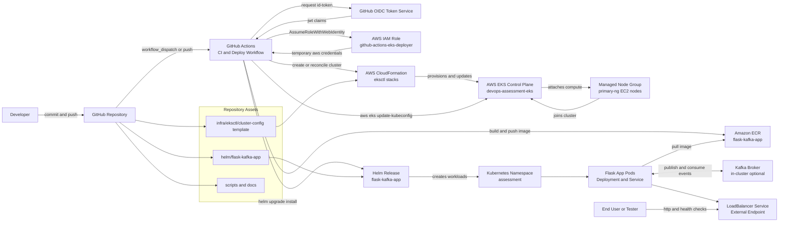

# End-to-End Architecture Diagram

This diagram shows the full application and infrastructure flow, from source control to runtime traffic.

## Notes

- Authentication is keyless through OIDC and IAM role assumption.
- Container images are stored in ECR and deployed into EKS using Helm.
- Kafka is optional and controlled by environment configuration.
- The workflow supports both first-time cluster creation and repeat deployments.
