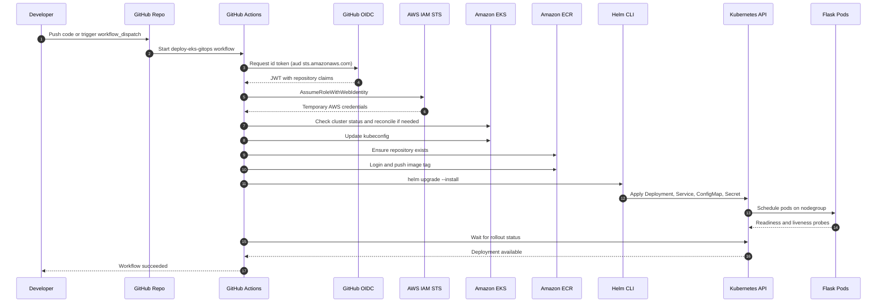

# Deployment Sequence Diagram

This sequence diagram focuses only on the deployment path from trigger to running workload.

## Key Failure Points Covered in Pipeline

- OIDC role assumption failure
- Missing or stale EKS/CloudFormation resources
- Nodegroup with zero registered nodes
- Rollout timeout with pod-level diagnostics
